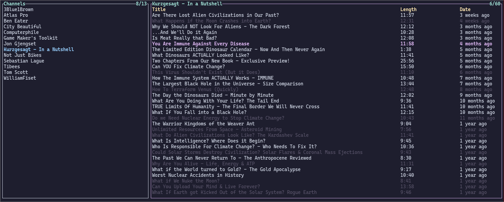
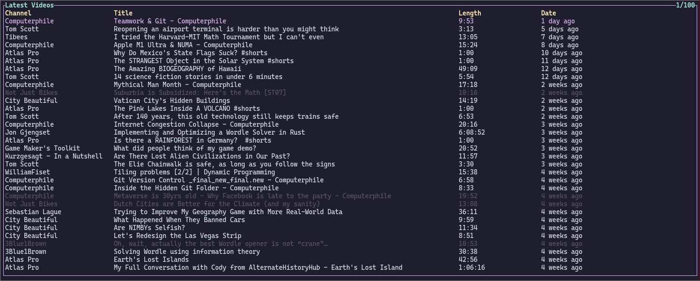

# ytsub

ytsub is a subscriptions only tui youtube client that uses the invidious api.




## Installation

`mpv` and `yt-dlp` are optional dependencies to play videos.

```
cargo install ytsub --git https://codeberg.org/sarowish/ytsub
```

## Usage

```
ytsub

USAGE:
    ytsub [OPTIONS]

OPTIONS:
    -d, --database-path <FILE>                 path to database file
    -g, --gen-instance-list                    generate invidious instances file
    -h, --help                                 Print help information
        --highlight-symbol <SYMBOL>            symbol to highlight selected items [default: ]
    -r, --request-timeout <REQUEST_TIMEOUT>    timeout in secs [default: 5]
    -s, --subs-path <FILE>                     path to subscriptions file
    -t, --tick-rate <TICK_RATE>                tick rate in milliseconds [default: 200]
```
## Configuration

Default directory of the configuration files is `~/.config/ytsub`.

| File        | Description                             |
|-------------|-----------------------------------------|
| `subs`      | includes the ids of subscribed channels |
| `instances` | includes the invidious instances        |

Every entry in these files is separated by a line.

To subscribe to channels add their ids to `subs` file.  
Example `subs` file:

```
UCsXVk37bltHxD1rDPwtNM8Q
UC0intLFzLaudFG-xAvUEO-A
UCBa659QWEk1AI4Tg--mrJ2A
```

If the `instances` file doesn't exist, every time you open the app, instances list will be built from https://api.invidious.io/.
You can either manually create the file and add instances that have api enabled or
automatically generate it from the instances in https://api.invidious.io/ by running the app with `-g` flag.  
Example `instances` file:

```
https://vid.puffyan.us
https://invidio.xamh.de
https://inv.riverside.rocks
https://yt.artemislena.eu
```


## Key Bindings

| Key Binding          | Action                                       |
| -------------------- | -------------------------------------------- |
| `h/l,left/right`     | switch to channels/videos block              |
| `k/j,up/down`        | go one line upward/downward                  |
| `g`                  | go to first line                             |
| `G`                  | go to last line                              |
| `c`                  | jump to channel from latest videos mode      |
| `1`                  | switch to subscriptions mode                 |
| `2`                  | switch to latest videos mode                 |
| `o`                  | open video in browser                        |
| `p`                  | play video in mpv                            |
| `t`                  | toggle hide                                  |
| `/`                  | search forward                               |
| `?`                  | search backward                              |
| `n`                  | repeat last search                           |
| `N`                  | repeat last search in the opposite direction |
| `r`                  | refresh selected channel                     |
| `R`                  | refresh all channels                         |
| `m`                  | toggle watched/unwatched                     |
| `q`,`ctrl+c`         | quit application                             |
